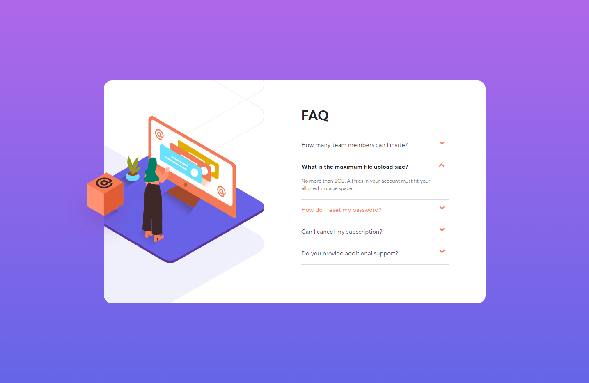
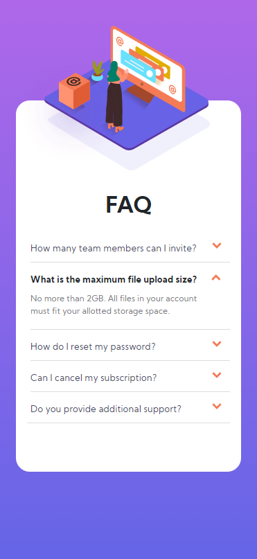

# Frontend Mentor - FAQ accordion card solution

This is a solution to the [FAQ accordion card challenge on Frontend Mentor](https://www.frontendmentor.io/challenges/faq-accordion-card-XlyjD0Oam). Frontend Mentor challenges help you improve your coding skills by building realistic projects.

## Table of contents

- [Overview](#overview)
  - [The challenge](#the-challenge)
  - [Screenshot](#screenshot)
  - [Links](#links)
- [My process](#my-process)
  - [Built with](#built-with)
  - [What I learned](#what-i-learned)
  - [Continued development](#continued-development)
  - [Useful resources](#useful-resources)
- [Author](#author)

## Overview

### The challenge

Users should be able to:

- View the optimal layout for the component depending on their device's screen size
- See hover states for all interactive elements on the page
- Hide/Show the answer to a question when the question is clicked

### Screenshot




### Links

- Solution URL: [https://www.frontendmentor.io/solutions/faq-page-challenge-WAg3xRpXJ]
- Live Site URL: [https://faq-page-two.vercel.app/]

## My process

### Built with

- Semantic HTML5 markup
- CSS custom properties
- Bootstrap
- Vanilla JS

### What I learned

Customizing bootstrap markups and styles were a bit challenging at first but it was a great learning experience!
After selecting multiple elements with querySelectorAll, you have to iterate them over to add the same logic or styles to those selected elements.

```html
<!-- FAQ section start-->
<div class="col-sm-6" id="faq-section">
  <h1 id="title">FAQ</h1>
  <!-- FAQ accordion start -->
  <div class="accordion accordion-flush" id="accordionExample">
    <!-- FAQ item #1 -->
    <div class="accordion-item">
      <h2 class="accordion-header" id="headingOne">
        <button
          class="accordion-button collapsed"
          type="button"
          data-bs-toggle="collapse"
          data-bs-target="#collapseOne"
          aria-expanded="false"
          aria-controls="collapseOne"
        >
          How many team members can I invite?
        </button>
      </h2>
      <div
        id="collapseOne"
        class="accordion-collapse collapse"
        aria-labelledby="headingOne"
        data-bs-parent="#accordionExample"
      >
        <div class="accordion-body">
          You can invite up to 2 additional users on the Free plan. There is no
          limit on team members for the Premium plan.
        </div>
      </div>
    </div>
  </div>
</div>
```

```css
.accordion-button::after {
  width: 1.6rem;
  background-size: 0.9rem;
  background-image: url(./images/icon-arrow-down.svg);
  transform-origin: 25% 25%;
}
```

```js
const buttons = document.querySelectorAll('.accordion-button');

buttons.forEach(function (btn) {
  btn.addEventListener('click', function () {
    this.classList.toggle('strong');
    buttons.forEach(function (b) {
      if (b.classList.contains('collapsed')) {
        b.classList.remove('strong');
      }
    });
  });
});
```

### Continued development

I would like to continue learning JS and useful libraries such as React, Vue, and Node etc.

### Useful resources

- [Programmatically change the src of an img tag](https://stackoverflow.com/questions/11722400/programmatically-change-the-src-of-an-img-tag)
- [Get window width and height](https://www.javadrive.jp/javascript/webpage/index6.html)

## Author

- codepen - [@JaJamaRu](https://codepen.io/JaJamaRu)
- Frontend Mentor - [@JaJamaRu14](https://www.frontendmentor.io/profile/JaJamaRu14)
- Twitter - [@shotime_14](https://twitter.com/shotime_14)
